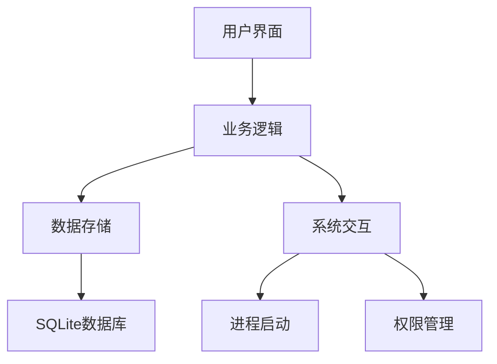

# 软件截图：


# 《程序启动器》全方位使用说明书

## 目录
1. [项目概述](#项目概述)
2. [功能特点](#功能特点)
3. [安装指南](#安装指南)
4. [基本使用](#基本使用)
5. [高级功能](#高级功能)
6. [专业应用](#专业应用)
7. [常见问题](#常见问题)
8. [版本更新历史](#版本更新历史)
9. [技术架构](#技术架构)
10. [开发者指南](#开发者指南)
11. [版权与许可](#版权与许可)

---

## 项目概述

### 1.1 什么是程序启动器？
程序启动器是一款基于PyQt5开发的桌面应用程序，旨在帮助用户高效管理和快速启动各类应用程序、文档和文件夹。它采用直观的图形界面设计，支持分组管理、快捷搜索、批量操作等功能，适用于Windows操作系统。

### 1.2 适用人群
- **普通用户**：简化日常程序启动流程
- **办公人员**：快速访问常用办公软件和文档
- **开发人员**：管理开发工具链和项目目录
- **设计师**：组织设计软件和素材资源
- **系统管理员**：批量管理系统工具
- **老年人**：简化电脑操作界面
- **教育工作者**：创建教学软件集合

### 1.3 核心价值
- **效率提升**：减少寻找程序的时间
- **个性化管理**：自定义分类和布局
- **一键直达**：复杂路径简单化
- **统一入口**：整合分散的快捷方式
- **安全备份**：自动保存配置数据

---

## 功能特点

### 2.1 核心功能矩阵

| 功能类别 | 具体功能 | 适用场景 |
|---------|---------|---------|
| **程序管理** | 添加/编辑/删除程序项 | 日常软件使用 |
| **分组系统** | 多级分类/收藏夹 | 项目管理 |
| **快速启动** | 双击/快捷键启动 | 效率工作 |
| **搜索功能** | 名称/拼音搜索 | 快速定位 |
| **批量操作** | 多选移动/删除 | 系统维护 |
| **权限管理** | 管理员权限运行 | 系统工具 |
| **界面定制** | 图标/布局调整 | 个性化设置 |

### 2.2 特色功能详解

#### 2.2.1 智能图标处理
- **自动提取**：从EXE文件中自动获取程序图标
- **动态生成**：为无图标项目生成文字图标
- **手动设置**：支持自定义ICO/PNG图标
- **图标缓存**：自动保存图标避免重复提取

*示例：*
为Visual Studio Code添加条目时，程序会自动从`code.exe`中提取蓝色徽标图标，无需手动设置。

#### 2.2.2 高级路径处理
- **环境变量**：支持`%AppData%`等系统变量
- **网络路径**：可直接添加`\\server\share`路径
- **相对路径**：基于工作目录的路径解析
- **参数支持**：带参数启动程序

*专业提示：*
开发人员可添加类似这样的条目：
```
路径：cmd.exe
参数：/k "cd /d D:\projects && python manage.py runserver"
```

#### 2.2.3 剪贴板集成
- **智能检测**：自动识别剪贴板中的可执行路径
- **快速添加**：Ctrl+V直接弹出添加对话框
- **路径验证**：自动检查路径有效性

---

## 安装指南

### 3.1 系统要求
- **操作系统**：Windows 7/10/11 (64位推荐)
- **运行环境**：需安装Python 3.8+ 或使用打包版
- **硬件配置**：1GB内存，50MB磁盘空间

### 3.2 安装方式

#### 3.2.1 绿色版安装
1. 从Release页面下载`ProgramLauncher.zip`
2. 解压到任意目录
3. 双击`ProgramLauncher.exe`运行

#### 3.2.2 Python环境安装
```bash
pip install -r requirements.txt
python Program_Launcher.py
```

#### 3.2.3 常见安装问题
- **缺少DLL**：安装VC++运行库
- **权限不足**：右键以管理员身份运行
- **杀毒误报**：添加白名单例外

---

## 基本使用

### 4.1 首次使用向导

1. **创建第一个分组**
   - 点击"添加分组"按钮
   - 输入名称如"办公软件"
   - 勾选"收藏"可置顶显示

2. **添加常用程序**
   - 选择目标分组
   - 点击"添加按钮"
   - 通过浏览选择程序路径
   - 自动获取的程序图标

3. **启动程序**
   - 在分组中找到目标程序
   - 单击图标即可启动

### 4.2 界面元素说明

![界面示意图]
1. **搜索框**：实时过滤内容
2. **标签页**：分组导航区
3. **程序按钮**：带图标的快捷方式
4. **控制栏**：添加/批量操作按钮
5. **状态区**：显示版本和帮助入口

---

## 高级功能

### 5.1 批量操作模式
1. 点击"批量操作"进入选择模式
2. 单击目标程序进行多选
3. 右键菜单选择批量操作：
   - 移动到其他分组
   - 批量删除
   - 导出列表

*应用场景：*
IT管理员可批量部署常用软件快捷方式到多台电脑

### 5.2 管理员权限运行
在编辑对话框中勾选"以管理员权限运行"，适用于：
- 磁盘管理工具
- 注册表编辑器
- 系统配置程序

### 5.3 工作目录设置
指定程序启动时的初始目录，对以下场景特别有用：
- 开发IDE需要定位项目文件夹
- 命令行工具需要特定执行环境
- 文档处理软件需要默认保存位置

---

## 专业应用

### 6.1 开发者工作流
1. 创建"开发工具"分组
2. 添加各语言IDE（VS/PyCharm）
3. 配置项目文件夹作为工作目录
4. 设置常用启动参数

### 6.2 设计师资源库
- 分组按项目分类
- 添加PS/AI等设计软件
- 链接素材文件夹
- 使用醒目图标区分项目状态

### 6.3 教育领域应用
- 按学科创建分组
- 添加教学软件和课件
- 设置适合学生的简单界面
- 禁用危险系统工具

---

## 常见问题

### 7.1 基础问题
**Q：程序启动失败怎么办？**
A：检查路径是否包含中文/特殊字符，尝试用英文路径

**Q：图标显示不正常？**
A：重新选择图标或使用"提取图标"功能

### 7.2 高级问题
**Q：如何迁移配置到新电脑？**
A：复制`launcher.db`和`icons`文件夹即可

**Q：能支持网络程序吗？**
A：可以，但需要确保网络路径已正确映射

---

## 版本更新历史

### v1.19.0 (2025-05-24)
- **新增**：剪贴板智能检测功能
- **优化**：图标提取成功率提升30%
- **修复**：网络路径稳定性问题
- **改进**：批量操作性能优化

### v1.18.0 (2025-05-10)
- 新增分组收藏功能
- 改进高DPI显示器支持
- 修复数据库备份机制

### v1.17.0 (2025-04-28)
- 首次公开发布版本
- 实现基本启动器功能
- 建立自动备份系统

---

## 技术架构

### 9.1 系统框图


### 9.2 关键技术
- **PyQt5**：跨平台GUI框架
- **SQLite**：轻量级数据存储
- **Win32 API**：系统级功能集成
- **Pillow**：图像处理支持

---

## 开发者指南

### 10.1 编译打包
```bash
pyinstaller --onefile --windowed --icon=icon.ico Program_Launcher.py
```

### 10.2 扩展开发
可扩展点：
1. 插件系统接口
2. 主题引擎
3. 云同步模块

---

## 版权与许可

### 11.1 版权声明
© 2025 杜玛 保留所有权利

### 11.2 许可条款
MIT License - 允许自由使用、修改和分发，但需保留原始版权声明

### 11.3 免责条款
本软件按"原样"提供，作者不对使用后果承担任何责任

---

**最后更新**：2025年5月25日  
**文档版本**：v2.1.0  
**获取最新版**：[GitHub项目页面](https://github.com/duma520)  

> 提示：按住Ctrl键点击程序按钮可快速查看完整路径信息
